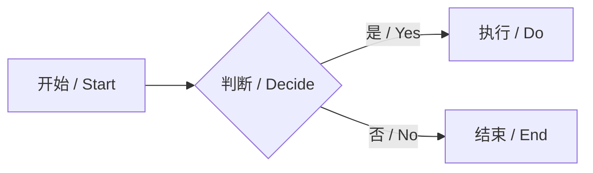
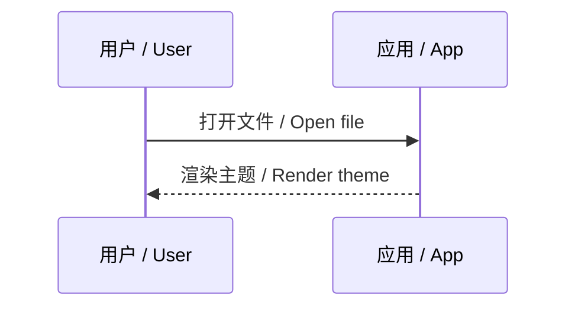

# Matoujie Demo

## 1. 文本 / Text

这是一段正文内容样式，以下是不同文本样式效果：**这是加粗文本样式**（Medium 500），<u>这是下划线样式</u>，*这是斜体字样式*，[这是超链接](https://github.com/)（注意链接图标），`This is a single line code style`，~~这是删除线效果样式~~，==这是文字高亮效果==，上下标样式：$\LaTeX$，X^2^，H~2~O，键盘键样式：<kbd>Command+Q</kbd>

This is a text content style and the following are the effects of different text styles: **This is a bold text style** (Medium 500), [This is a hyperlink style](https://github.com) (notice the link icon), *This is the italic font style*, ~~This is the strikethrough effect style~~, <u>This is the underline style</u>, `This is a single line code style`, keyboard key style: <kbd>Command+Q</kbd>, $\LaTeX$ X^2^ H~2~O, ==This is the text highlighting effect==

> 一段引用文本
> A blockquote for testing.

---

## 2. 字体系统 / Font System

**Inter** — 英文正文 / UI（Regular 400）
The quick brown fox jumps over the lazy dog. Anthropic builds AI that is safe and beneficial — for everyone.

**Noto Sans SC** — 中文正文（Light 300，视觉重量与 Inter Regular 对齐）
这是一段示例文字。信息、美感与秩序，是好的排版永恒追求的三件事。简洁，并不意味着简单。

**JetBrains Mono** — 代码块（Regular 400，含连字）
```javascript
const theme = {
  primary: "#d97757",   // Clay
  bg: "#faf9f5",        // Ivory
  font: "Inter",        // English
};
```

---

## 3. 标题层级 / Headings

### 三级标题 / H3

#### 四级标题 / H4

##### 五级标题 / H5

###### 六级标题 / H6

---

## 4. 代码块 / Code Blocks

单行代码样式 / Inline code：`README`

```python
import os
from openai import OpenAI

client = OpenAI(api_key=os.environ.get("OPENAI_API_KEY"))

resp = client.chat.completions.create(
    model="gpt-4o-mini",
    messages=[
        {"role": "system", "content": "You are a helpful assistant."},
        {"role": "user", "content": "Write a haiku about Hokkaido."},
    ],
)

print(resp.choices[0].message.content)
```

---

## 5. 数学公式 / Math

设数据样本 $x_0\sim q(x_0)$，扩散模型的前向过程逐步加入高斯噪声：

$$
q(x_t \mid x_{t-1})=\mathcal N\bigl(x_t;\sqrt{1-\beta_t}\,x_{t-1},\,\beta_t\mathbf I\bigr),\quad t=1,\dots,T
$$

---

## 6. 引用 / Blockquotes

> 单层引用：读书破万卷，下笔如有神。
> Single quote: "Read ten thousand books, write as if inspired."

> 多层引用 / Nested:
> > 二级引用 / Level 2
> > > 三级引用 / Level 3

---

## 7. Callout 卡片 / Alert Cards

> [!NOTE]
>
> **Info Card** — 信息卡片，象牙色背景，暖色边框。适用于补充说明、背景知识。
>
> `this is code style`

> [!TIP]
>
> **Stat Card** — 数据卡片，居中大数字展示。适用于突出关键指标。
>
> 99.9%
>
> 可用性 / Uptime

> [!IMPORTANT]
>
> **Feature Card** — 深色卡片，Clay 强调色。适用于重要特性、核心概念。
>
> This is a Feature card with dark surface and warm accent color.

> [!WARNING]
>
> **Quote Card** — 引用卡片，衬线引号装饰。适用于名言、 editorial 引用。
>
> 好的设计是尽可能少的设计。
>
> — Dieter Rams

> [!CAUTION]
>
> **Danger Card** — 警告卡片，红色边框。适用于错误提示、危险操作提醒。
>
> 此操作不可逆，请确认后执行。

---

## 8. 列表 / Lists

### 8.1 无序列表 / Unordered

- 苹果 / Apple
- 香蕉 / Banana
  - 青香蕉 / Green banana
  - 熟香蕉 / Ripe banana
- 樱桃 / Cherry

### 8.2 有序列表 / Ordered

1. 第一步 / Step one
2. 第二步 / Step two
3. 第三步 / Step three

### 8.3 任务列表 / Task Lists

- [ ] 待办事项 / Todo item
- [x] 已完成事项 / Done item
- [ ] 另一个任务 / Another task

---

## 9. 表格 / Tables

| 项目 / Item | 数量 / Qty | 备注 / Note |
|:-:|:--:|:--:|
| 铅笔 / Pencil | 2 | HB |
| 橡皮 / Eraser | 1 | 白色 / White |
| 笔记本 / Notebook | 3 | A5 |

---

## 10. 链接图标 / Link Icons

以下链接会自动显示图标（钉）：

- [GitHub](https://github.com/)
- [Google](https://google.com)
- [Typora 官网](https://typora.io/)

锚点链接不显示图标：[跳转到顶部](#matoujie-demo)

---

## 11. 图表 / Diagrams




